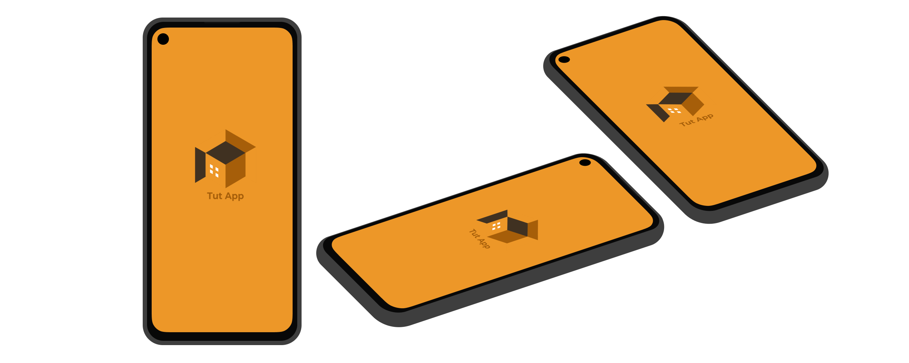
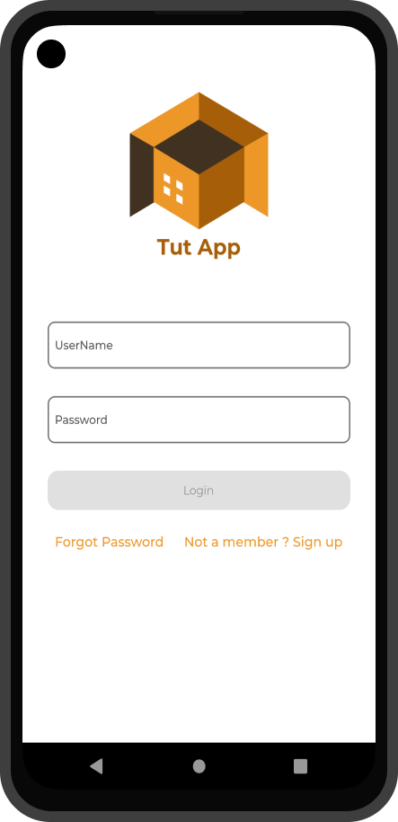
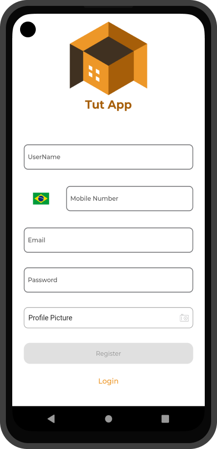
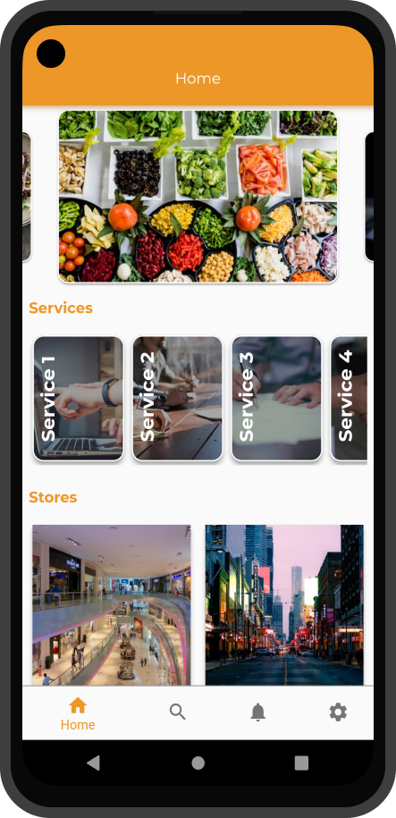

  
<h4  align="center">
	⚡ Tut App
</h4>

  

<a  href="#telescope-projeto">🔭 Projeto</a>&nbsp;&nbsp;&nbsp;|&nbsp;&nbsp;&nbsp
<a  href="#-preview">💜 Preview</a>&nbsp;&nbsp;&nbsp;

  

## :telescope: Projeto
 
 
Projeto desenvolvido durante o curso de Flutter da Udemy [Flutter Advanced Course](https://www.udemy.com/course/flutter-advanced-course-clean-architecture-with-mvvm/).

  
## 💜 Preview
 

 

--- 

<h5 align="center"> 🚀 Tut App  by Luuck4s 💜 </h5>

---